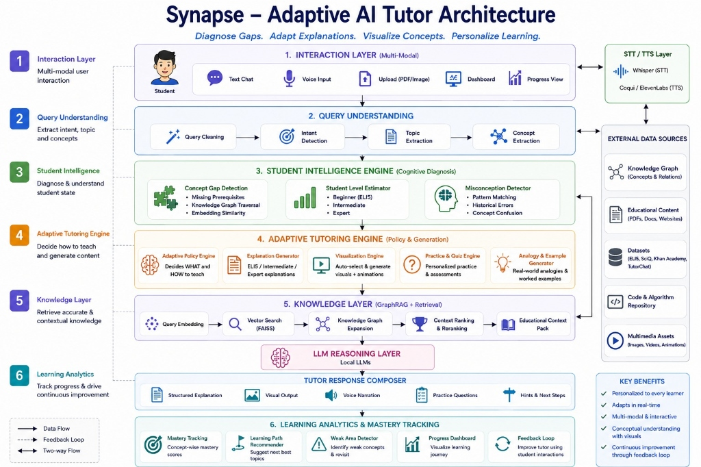

# Synapse – Adaptive AI Tutor

> A premium, multi-modal Adaptive AI Tutoring System combining GraphRAG, local LLMs, and dynamic visual engines for a highly personalized learning experience.

The **Synapse Suite** is a unified product console that delivers an adaptive learning experience. It diagnoses knowledge gaps, adapts explanations to the student's proficiency level, visualizes complex concepts step-by-step, and personalizes the learning journey dynamically.

## Problem It Solves

Traditional education platforms offer one-size-fits-all content that doesn't adapt to individual learning paces or missing prerequisites. Synapse solves this by dynamically diagnosing each learner's exact knowledge gaps using a GraphRAG-powered Knowledge Graph, adapting its teaching policy in real-time (Beginner/Intermediate/Expert), and providing hands-free, voice-enabled multi-modal interactions alongside step-by-step interactive algorithm visualizations.

---


---

## Table of Contents
- [Features](#features)
- [System Architecture](#system-architecture)
- [Demo / Screenshots](#demo--screenshots)
- [Tech Stack](#tech-stack)
- [Project Structure](#project-structure)
- [Installation & Setup](#installation--setup)
- [Usage](#usage)
- [API Documentation](#api-documentation)
- [Testing](#testing)
- [Deployment](#deployment)
- [Contributing](#contributing)
- [Roadmap / Future Improvements](#roadmap--future-improvements)
- [License](#license)
- [Contact / Author](#contact--author)

---

## Features

### Key Functionalities
- **GraphRAG Retrieval**: Hybrid Knowledge Graph-expanded vector retrieval leveraging FAISS and NetworkX to boost relevant learning chunks.
- **Adaptive Assessment**: 15-question dynamic diagnostics that determine proficiency (Beginner, Intermediate, Advanced) and detect local knowledge gaps.
- **Visual Animation Engine**: Standalone visualizer that illustrates intricate structures (Transformer Attention, Neural Networks, Binary Search, Recursion) step-by-step with synchronized audio narration (gTTS) and PIL crossfades.
- **Local Voice Layer**: Zero-friction hands-free learning using local speech-to-text and text-to-speech technologies.
- **Offline Cytoscape Roadmaps**: Dynamically generated, completely offline learning tree layouts.
- **Premium Frosted Glassmorphism UI**: High-fidelity, dynamic frontend design built natively with HTML/CSS integrated into a Streamlit environment.

### Highlight Major Capabilities
Synapse's true power lies in its **Student Intelligence Engine** and **Adaptive Tutoring Engine**. It builds a real-time mental model of the student, identifies specific prerequisites they are missing, and generates perfectly tailored explanations, analogies, and practice quizzes on the fly using a local LLM integration.

---

## System Architecture

The architecture consists of six primary layers:
1. **Interaction Layer**: Multi-modal inputs including Text Chat, Voice Input (Whisper STT), PDF/Image Upload, and a Progress Dashboard.
2. **Query Understanding**: Extracts intent, topics, and concepts from the student's input.
3. **Student Intelligence Engine**: Performs cognitive diagnosis to detect concept gaps, estimate student level (Beginner/Intermediate/Expert), and identify misconceptions.
4. **Adaptive Tutoring Engine**: Uses a policy engine to decide *what* and *how* to teach, generating explanations, analogies, and auto-selecting visual animations.
5. **Knowledge Layer (GraphRAG)**: Retrieves educational context via Query Embedding, FAISS Vector Search, Knowledge Graph Expansion, and Reranking, powered by local LLM reasoning.
6. **Learning Analytics**: Tracks concept-wise mastery, recommends learning paths, and builds a continuous feedback loop.



---

## Demo / Screenshots

*Placeholder for demo links and screenshots.* 
- [Link to Live Demo](#)

### App Previews
- **Screenshot 1**: `` - The premium Hub Workspace.
- **Screenshot 2**: `` - Visual Engine animating a Transformer Attention layer.

---

## Tech Stack

### Frontend
- **UI Framework**: HTML5, Vanilla CSS3, Native JavaScript
- **App Engine**: Streamlit (v1.30+)
- **Visuals & Charts**: Plotly, Matplotlib, PIL (Python Imaging Library)

### Backend
- **Core Logic**: Python 3.11+
- **LLM Integration**: Ollama API (GPT-OSS on local network)
- **Vector Search & Embeddings**: FAISS (Facebook AI Similarity Search), `sentence-transformers` (`all-MiniLM-L6-v2`)
- **Knowledge Graph**: NetworkX

### Database
- **Progress Tracking**: Local JSON-based storage (`data/progress.json`)
- **Vector Store**: Cached FAISS Binary Indices
- **Documents**: Processed PDF textbooks

### Tools & DevOps
- **Version Control**: Git
- **Dependency Management**: pip
- **TTS/STT**: gTTS, Whisper (Local integration)

---

## Project Structure

```text
Team-A2/
├── index.html                      # Premium unified Hub Workspace (Entry point)
├── README.md                       # Project Documentation
├── synapse_ai_tutor/               # Main Adaptive AI Tutor subsystem (Port 8501)
│   ├── app.py                      # Subsystem entry point and routing
│   ├── requirements.txt            
│   ├── backend/                    # Core ML, RAG, and logic modules
│   ├── pages/                      # Application views (Topics, Tutor, Dashboard, etc.)
│   └── data/                       # Cached embeddings, graphs, and PDFs
└── visual_engine/                  # Visual Animation Engine subsystem (Port 8502)
    ├── main.py                     # Subsystem entry point
    ├── requirements.txt
    ├── router.py                   # Maps topics to animation logic
    └── visualizers/                # Animation algorithms (Neural Nets, Transformers, etc.)
```

---

## Installation & Setup

### Prerequisites
- Python 3.11 or higher
- Git
- (Optional) Local Ollama server running `gpt-oss:20b` or a similar model for live LLM responses. The app will fall back to local extraction if unavailable.

### Step-by-Step Installation Instructions

1. **Clone the repository:**
   ```bash
   git clone https://github.com/Gen-AI-Hackathon-2026/Team-A2.git
   cd Team-A2
   ```

2. **Install dependencies for Synapse AI Tutor:**
   ```bash
   cd synapse_ai_tutor
   pip install -r requirements.txt
   cd ..
   ```

3. **Install dependencies for Visual Engine:**
   ```bash
   cd visual_engine
   pip install -r requirements.txt
   cd ..
   ```

### Environment Variables Setup
No strict `.env` file is required out of the box. Ensure your local Ollama server is running on `http://localhost:11434` (the default port). You can configure the Ollama host directly from the connection settings UI in the app if you are running it on a different IP or port.

---

## How to Run Locally

You must run both Streamlit subsystems simultaneously, then open the `index.html` hub to use the cohesive application environment.

1. **Start the Synapse AI Tutor (Terminal 1):**
   ```bash
   cd synapse_ai_tutor
   python -m streamlit run app.py --server.port 8501
   ```

2. **Start the Visual Engine (Terminal 2):**
   ```bash
   cd visual_engine
   python -m streamlit run main.py --server.port 8502
   ```

3. **Launch the Hub Workspace:**
   Open the `index.html` file in your preferred modern web browser (Chrome/Edge/Safari). The Hub will embed both running subsystems into a single visually appealing startup-grade UI.

---

## Usage

### Example Commands
Once the app is running:
- Navigate to **Topics** to select a module (e.g., Deep Learning).
- Use the **Assessment** tab to calibrate your initial proficiency level.
- Interact with the **Tutor** chat to ask conceptual questions (e.g., "Explain Self-Attention").
- Switch to the **Visual Engine** tab to see step-by-step architectural animations of what you just learned.

### API Documentation
*N/A - System is currently monolithic via Streamlit and direct Python imports. External API usage is limited to Ollama endpoints (`/api/generate`) which are handled internally by `backend/llm_client.py`.*

---

## Testing

To verify the system components:
1. **Knowledge Graph**: Check the knowledge graph structure using the in-app **Visualizer** page in the AI Tutor.
2. **Retrieval Engine**: Run local diagnostics on the FAISS index by verifying chunk responses in the **Chatbot** page.
3. **Animations**: Test TTS narration and rendering in the **Visual Engine** by selecting a complex topic (e.g. Transformer Attention) and toggling the audio checkbox.

*(Dedicated pytest suite coming soon)*

---

## Deployment

Synapse is designed to be easily containerised. 
1. Create a `Dockerfile` exposing ports `8501` (Tutor) and `8502` (Visual Engine).
2. Host `index.html` via a lightweight static server (e.g., Nginx) that points iframes to the exposed Streamlit ports.
3. Deploy to AWS EC2, Google Cloud Run, or any scalable container service.

---

## Contributing

We welcome contributions to the Synapse Suite!

### Contribution Guidelines
1. Fork the repository.
2. Create a new branch (`git checkout -b feature/your-feature`).
3. Commit your changes (`git commit -m 'Add some feature'`).
4. Push to the branch (`git push origin feature/your-feature`).

### Pull Request Process
- Ensure code follows standard PEP 8 Python guidelines.
- Test your changes locally on both ports (8501 and 8502).
- Open a PR describing the problem solved and the implementation details. Wait for maintainers to review.

---

## Roadmap / Future Improvements
- [ ] **Cloud Sync**: Centralized MongoDB for cross-device progress syncing.
- [ ] **Expanded Visuals**: Add visualizers for CNNs, GANs, and Diffusion Models.
- [ ] **Docker Compose**: Single-command orchestrated deployment.
- [ ] **Multi-language Support**: Voice narration and LLM interaction in languages other than English.

---

## License
Distributed under the MIT License. See `LICENSE` for more information.

---

## Contact / Author
**Team A2**  
Gen AI Hackathon 2026  
Repository: [https://github.com/Gen-AI-Hackathon-2026/Team-A2](https://github.com/Gen-AI-Hackathon-2026/Team-A2)
