# Synapse AI Tutor — Enterprise SaaS Modernization Plan

> **Principal Architect Review Document** · July 2026  
> Transforming a Streamlit MVP into a production-grade, enterprise SaaS platform

---

## Executive Summary

The current Synapse AI Tutor is a well-structured Streamlit MVP with **excellent AI business logic** — a fully-working RAG pipeline (FAISS + BM25 hybrid), GraphRAG with NetworkX, adaptive LLM tutoring (Groq/Ollama), a student digital twin (memory + progress), a 15-question assessment engine, TTS/STT voice layer, and SQLAlchemy ORM models already defined. The Streamlit UI layer is the only piece that needs replacement. The AI core is **production-ready** and will be preserved intact.

The strategy: **Lift the AI brain, replace the face.** Extract all backend business logic into a FastAPI service layer, expose it through versioned REST + SSE APIs, and build a premium React + TypeScript frontend that consumes those APIs.

---

## 1. Architecture Diagram

```mermaid
graph TB
    subgraph "Client Layer"
        WEB["🌐 React + TypeScript\n(Vite SPA)"]
        MOB["📱 Mobile App\n(Future)"]
        PUB["🔌 Public API\n(Future)"]
    end

    subgraph "CDN / Edge"
        CDN["☁️ Cloudflare CDN\n(Static Assets + Edge Cache)"]
    end

    subgraph "API Gateway"
        GW["🚦 FastAPI Gateway\n(v1 Router, Auth Middleware,\nRate Limiting, CORS)"]
    end

    subgraph "Service Layer — FastAPI Routers"
        AUTH["🔐 Auth Service\n/api/v1/auth"]
        TUTOR["🎓 Tutor Service\n/api/v1/tutor"]
        CHAT["💬 Chat Service\n/api/v1/chat"]
        ASSESS["📝 Assessment Service\n/api/v1/assessment"]
        MEMORY["🧠 Memory Service\n/api/v1/memory"]
        RAG["📚 RAG Service\n/api/v1/rag"]
        GRAPH["🕸️ Knowledge Graph Service\n/api/v1/graph"]
        VOICE["🎙️ Voice Service\n/api/v1/voice"]
        NOTES["📓 Notes Service\n/api/v1/notes"]
        ROAD["🗺️ Roadmap Service\n/api/v1/roadmap"]
        DASH["📊 Dashboard Service\n/api/v1/dashboard"]
    end

    subgraph "AI Core — Preserved Python Modules"
        LLM["⚡ LLM Client\nGroq / Ollama"]
        RAGCORE["🔍 RAG Pipeline\nFAISS + BM25 Hybrid"]
        GRAPHCORE["🕸️ GraphRAG\nNetworkX"]
        ASMCORE["📋 Assessment Engine\n15Q / Weighted Scoring"]
        MEMCORE["👤 Student Memory\nDigital Twin"]
        TTSCORE["🔊 TTS Engine\ngTTS / ElevenLabs"]
        STTCORE["🎤 STT Engine\nWhisper / Groq"]
        NOTECORE["📄 Note Generator\nLLM + RAG"]
        ROADCORE["🗺️ Roadmap Generator\nPrereq Graph"]
    end

    subgraph "Background Workers — Celery + Redis"
        WORKER["⚙️ Celery Workers\n(TTS, Note Gen, Embedding)"]
        BEAT["⏰ Celery Beat\n(Spaced Repetition, Cleanup)"]
        REDIS["🔴 Redis\n(Task Queue + Cache)"]
    end

    subgraph "Data Layer"
        PG["🐘 PostgreSQL 16\n(Primary Store)"]
        FAISS["📊 FAISS Index\n(Vector Store)"]
        FILES["📁 File Storage\n(PDFs, Audio Cache)"]
        S3["☁️ S3 / MinIO\n(Future: Cloud Storage)"]
    end

    WEB --> CDN
    MOB --> GW
    PUB --> GW
    CDN --> GW

    GW --> AUTH
    GW --> TUTOR
    GW --> CHAT
    GW --> ASSESS
    GW --> MEMORY
    GW --> RAG
    GW --> GRAPH
    GW --> VOICE
    GW --> NOTES
    GW --> ROAD
    GW --> DASH

    TUTOR --> LLM
    TUTOR --> RAGCORE
    TUTOR --> GRAPHCORE
    CHAT --> LLM
    CHAT --> MEMCORE
    ASSESS --> ASMCORE
    MEMORY --> MEMCORE
    RAG --> RAGCORE
    GRAPH --> GRAPHCORE
    VOICE --> TTSCORE
    VOICE --> STTCORE
    NOTES --> NOTECORE
    NOTES --> RAGCORE
    ROAD --> ROADCORE

    WORKER --> TTSCORE
    WORKER --> NOTECORE
    WORKER --> RAGCORE
    WORKER --> REDIS
    BEAT --> REDIS

    AUTH --> PG
    TUTOR --> PG
    ASSESS --> PG
    MEMORY --> PG
    NOTES --> PG
    ROAD --> PG

    RAGCORE --> FAISS
    TTSCORE --> FILES
    STTCORE --> FILES
```



---

## 2. Recommended Technology Stack

### Backend
| Layer | Technology | Justification |
|-------|-----------|---------------|
| **Web Framework** | FastAPI 0.111+ | Async-native, automatic OpenAPI docs, dependency injection, SSE streaming support |
| **ASGI Server** | Uvicorn + Gunicorn | Production-grade, multiprocess support |
| **Task Queue** | Celery 5 + Redis | Background TTS synthesis, note generation, embedding refreshes |
| **Database ORM** | SQLAlchemy 2.0 async + asyncpg | Already used in `storage/models.py` — zero migration needed |
| **Migrations** | Alembic | Already configured — preserve as-is |
| **Cache** | Redis (via `redis-py` async) | Response cache, session store, Celery broker |
| **Auth** | JWT (PyJWT) + OAuth2 (Authlib) | Already in `services/auth_service.py` and `backend/auth.py` |
| **Validation** | Pydantic v2 | Already used in `config/settings.py` |
| **Streaming** | SSE (Server-Sent Events) via FastAPI `StreamingResponse` | LLM response streaming without WebSocket complexity |
| **API Docs** | Auto-generated via FastAPI | OpenAPI 3.1 / Swagger UI |

### Frontend
| Layer | Technology | Justification |
|-------|-----------|---------------|
| **Framework** | React 19 + TypeScript | Type safety, huge ecosystem, hiring pool |
| **Build Tool** | Vite 6 | Fastest HMR, native ESM, optimal production builds |
| **Routing** | React Router v7 | File-based routing, nested layouts, lazy loading |
| **State — Client** | Zustand | Minimal boilerplate, devtools, immer integration |
| **State — Server** | TanStack Query v5 | Caching, background refetch, optimistic updates, streaming |
| **Styling** | Tailwind CSS v4 | Design system tokens, dark mode, responsive utilities |
| **Component Library** | shadcn/ui (Radix primitives) | Accessible, unstyled, composable, TypeScript-first |
| **Animations** | Framer Motion | Premium page transitions, micro-animations |
| **Charts / Viz** | Recharts + D3.js (KG visualization) | Already using Plotly/NetworkX data — map to Recharts |
| **Icons** | Lucide React | Consistent, tree-shakable icon set |
| **Markdown** | react-markdown + rehype-highlight | Render LLM markdown responses with syntax highlighting |
| **Forms** | React Hook Form + Zod | Type-safe form validation |
| **Real-time** | EventSource (SSE) | Streaming LLM responses from FastAPI SSE endpoints |

### Infrastructure
| Component | Technology |
|-----------|-----------|
| **Containerization** | Docker + Docker Compose |
| **Reverse Proxy** | Nginx |
| **CI/CD** | GitHub Actions |
| **Monitoring** | Prometheus + Grafana (future) |
| **Logging** | structlog (already in project) + centralized log aggregation |

---

## 3. Complete Folder Structure

### Backend (`synapse-backend/`)

```
synapse-backend/
├── app/
│   ├── __init__.py
│   ├── main.py                    # FastAPI app factory
│   ├── dependencies.py            # DI providers (get_db, get_rag_pipeline, etc.)
│   │
│   ├── api/
│   │   ├── __init__.py
│   │   └── v1/
│   │       ├── __init__.py
│   │       ├── router.py          # Aggregate all v1 routers
│   │       ├── auth.py            # POST /auth/login, /auth/register, /auth/refresh
│   │       ├── tutor.py           # POST /tutor/explain  (SSE streaming)
│   │       ├── chat.py            # POST /chat/message, GET /chat/history
│   │       ├── assessment.py      # POST /assessment/start, /assessment/submit
│   │       ├── memory.py          # GET /memory/profile, /memory/gaps
│   │       ├── rag.py             # POST /rag/search, POST /rag/reindex
│   │       ├── graph.py           # GET /graph/data, GET /graph/expand
│   │       ├── voice.py           # POST /voice/tts, POST /voice/stt
│   │       ├── notes.py           # GET /notes, POST /notes/generate
│   │       ├── roadmap.py         # GET /roadmap/{topic}, POST /roadmap/generate
│   │       └── dashboard.py       # GET /dashboard/stats, /dashboard/activity
│   │
│   ├── core/                      # ← PRESERVED from existing project
│   │   ├── __init__.py
│   │   ├── constants.py
│   │   ├── exceptions.py
│   │   └── types.py               # StudentLevel, MasteryLevel, all domain types
│   │
│   ├── config/                    # ← PRESERVED + extended
│   │   ├── __init__.py
│   │   ├── settings.py            # Pydantic Settings (already production-ready)
│   │   └── logging_config.py
│   │
│   ├── services/                  # Business logic layer (orchestration)
│   │   ├── __init__.py
│   │   ├── auth_service.py        # ← PRESERVED from existing services/auth_service.py
│   │   ├── tutor_service.py       # Orchestrates LLM + RAG + Memory
│   │   ├── chat_service.py        # Manages conversation state + history
│   │   ├── assessment_service.py  # Wraps backend/assessment.py
│   │   ├── memory_service.py      # ← PRESERVED from existing services/memory_service.py
│   │   ├── rag_service.py         # Wraps backend/rag.py RAGPipeline
│   │   ├── graph_service.py       # Wraps backend/knowledge_graph.py
│   │   ├── voice_service.py       # Wraps backend/tts.py + backend/stt.py
│   │   ├── notes_service.py       # Wraps backend/note_generator.py
│   │   ├── roadmap_service.py     # Wraps backend/roadmap_generator.py
│   │   └── dashboard_service.py   # Aggregates user analytics
│   │
│   ├── ai/                        # ← PRESERVED intact from existing project
│   │   ├── __init__.py
│   │   ├── graph/
│   │   └── rag/
│   │       ├── chunking.py
│   │       ├── citation_generator.py
│   │       ├── compressor.py
│   │       ├── hybrid_retriever.py
│   │       ├── pipeline.py
│   │       └── reranker.py
│   │
│   ├── backend/                   # ← PRESERVED intact (all AI modules)
│   │   ├── assessment.py          # 15Q assessment engine
│   │   ├── auth.py                # Credential hashing
│   │   ├── chunking.py
│   │   ├── embeddings.py
│   │   ├── gap_detector.py
│   │   ├── graph_rag.py
│   │   ├── knowledge_graph.py     # NetworkX graph
│   │   ├── llm_client.py          # Groq + Ollama (remove Streamlit import)
│   │   ├── note_generator.py
│   │   ├── progress_tracker.py
│   │   ├── rag.py                 # RAGPipeline
│   │   ├── resources.py
│   │   ├── retriever.py
│   │   ├── roadmap_generator.py
│   │   ├── stt.py
│   │   ├── student_memory.py
│   │   ├── tts.py
│   │   ├── voice_components.py
│   │   ├── voice_config.py
│   │   └── voice_health.py
│   │
│   ├── storage/                   # ← PRESERVED intact (ORM models + repos)
│   │   ├── __init__.py
│   │   ├── base.py
│   │   ├── database.py            # Async SQLAlchemy engine
│   │   ├── json_store.py
│   │   ├── models.py              # All ORM tables (already defined!)
│   │   ├── migrations/            # Alembic migrations
│   │   └── repositories/
│   │
│   ├── schemas/                   # Pydantic request/response models (NEW)
│   │   ├── __init__.py
│   │   ├── auth.py                # LoginRequest, TokenResponse, UserResponse
│   │   ├── tutor.py               # TutorRequest, TutorResponse (SSE event types)
│   │   ├── chat.py                # ChatMessage, ChatHistory
│   │   ├── assessment.py          # AssessmentQuestion, AssessmentSubmission
│   │   ├── memory.py              # StudentProfile, KnowledgeGap
│   │   ├── notes.py               # NoteResponse, NoteGenerateRequest
│   │   ├── roadmap.py             # RoadmapStep, RoadmapResponse
│   │   └── dashboard.py           # DashboardStats, ActivityFeed
│   │
│   ├── middleware/                # Custom ASGI middleware (NEW)
│   │   ├── __init__.py
│   │   ├── auth.py                # JWT bearer token extraction
│   │   ├── rate_limit.py          # Per-user rate limiting via Redis
│   │   ├── logging.py             # Request/response structured logging
│   │   └── cors.py                # CORS configuration
│   │
│   └── workers/                   # Celery background tasks (NEW)
│       ├── __init__.py
│       ├── celery_app.py
│       ├── tasks/
│       │   ├── tts_task.py        # Async TTS synthesis
│       │   ├── notes_task.py      # Background note generation
│       │   ├── reindex_task.py    # RAG re-embedding on new documents
│       │   └── cleanup_task.py    # Audio cache eviction (beat task)
│       └── beat_schedule.py
│
├── data/                          # ← PRESERVED
│   ├── books/                     # PDF source documents
│   ├── chunks.pkl                 # FAISS chunk cache
│   ├── faiss_index.bin            # FAISS vector index
│   ├── knowledge_graph.json       # KG node/edge data
│   └── student_memory.json        # Legacy JSON store (migrated to PG)
│
├── tests/
│   ├── unit/
│   ├── integration/
│   └── e2e/
│
├── alembic.ini                    # ← PRESERVED
├── docker-compose.yml             # Extended with Redis, backend, worker
├── Dockerfile
├── pyproject.toml
└── .env.example                   # ← PRESERVED + extended
```

### Frontend (`synapse-frontend/`)

```
synapse-frontend/
├── public/
│   ├── favicon.ico
│   └── og-image.png
│
├── src/
│   ├── main.tsx                   # React 19 root
│   ├── App.tsx                    # Router + providers
│   ├── vite-env.d.ts
│   │
│   ├── features/                  # Feature-based modules
│   │   ├── auth/
│   │   │   ├── components/
│   │   │   │   ├── LoginForm.tsx
│   │   │   │   └── OAuthButtons.tsx
│   │   │   ├── hooks/
│   │   │   │   └── useAuth.ts
│   │   │   ├── store/
│   │   │   │   └── authStore.ts   # Zustand auth slice
│   │   │   ├── api/
│   │   │   │   └── authApi.ts     # TanStack Query hooks
│   │   │   └── pages/
│   │   │       └── LoginPage.tsx
│   │   │
│   │   ├── tutor/
│   │   │   ├── components/
│   │   │   │   ├── TutorChat.tsx
│   │   │   │   ├── StreamingMessage.tsx
│   │   │   │   ├── SourcePanel.tsx
│   │   │   │   ├── PracticeQuestions.tsx
│   │   │   │   └── TutorHeader.tsx
│   │   │   ├── hooks/
│   │   │   │   └── useTutorStream.ts  # SSE streaming hook
│   │   │   └── pages/
│   │   │       └── TutorPage.tsx
│   │   │
│   │   ├── assessment/
│   │   │   ├── components/
│   │   │   │   ├── QuestionCard.tsx
│   │   │   │   ├── ProgressBar.tsx
│   │   │   │   └── ResultsView.tsx
│   │   │   └── pages/
│   │   │       └── AssessmentPage.tsx
│   │   │
│   │   ├── dashboard/
│   │   │   ├── components/
│   │   │   │   ├── MasteryRadar.tsx
│   │   │   │   ├── ActivityHeatmap.tsx
│   │   │   │   ├── StreakCard.tsx
│   │   │   │   ├── TopicProgress.tsx
│   │   │   │   └── RecentActivity.tsx
│   │   │   └── pages/
│   │   │       └── DashboardPage.tsx
│   │   │
│   │   ├── knowledge-graph/
│   │   │   ├── components/
│   │   │   │   ├── GraphCanvas.tsx    # D3.js force-directed graph
│   │   │   │   ├── NodeDetail.tsx
│   │   │   │   └── GraphControls.tsx
│   │   │   └── pages/
│   │   │       └── KnowledgeGraphPage.tsx
│   │   │
│   │   ├── notes/
│   │   │   ├── components/
│   │   │   │   ├── NoteCard.tsx
│   │   │   │   ├── NoteViewer.tsx
│   │   │   │   └── NoteGenerator.tsx
│   │   │   └── pages/
│   │   │       └── NotesPage.tsx
│   │   │
│   │   ├── roadmap/
│   │   │   ├── components/
│   │   │   │   ├── RoadmapTimeline.tsx
│   │   │   │   └── RoadmapStep.tsx
│   │   │   └── pages/
│   │   │       └── RoadmapPage.tsx
│   │   │
│   │   ├── voice/
│   │   │   ├── components/
│   │   │   │   ├── VoiceInput.tsx
│   │   │   │   └── AudioPlayer.tsx
│   │   │   └── hooks/
│   │   │       └── useVoice.ts
│   │   │
│   │   └── profile/
│   │       ├── components/
│   │       │   ├── ProfileHeader.tsx
│   │       │   └── PreferencesForm.tsx
│   │       └── pages/
│   │           └── ProfilePage.tsx
│   │
│   ├── components/                # Shared / global UI components
│   │   ├── ui/                    # shadcn/ui primitives
│   │   │   ├── Button.tsx
│   │   │   ├── Card.tsx
│   │   │   ├── Dialog.tsx
│   │   │   ├── Input.tsx
│   │   │   ├── Badge.tsx
│   │   │   ├── Skeleton.tsx
│   │   │   ├── Tooltip.tsx
│   │   │   └── ...
│   │   ├── layout/
│   │   │   ├── AppShell.tsx       # Sidebar + main content wrapper
│   │   │   ├── Sidebar.tsx        # Navigation sidebar
│   │   │   ├── TopBar.tsx         # Header with user menu
│   │   │   └── PageContainer.tsx
│   │   ├── common/
│   │   │   ├── LoadingSpinner.tsx
│   │   │   ├── ErrorBoundary.tsx
│   │   │   ├── EmptyState.tsx
│   │   │   ├── MarkdownRenderer.tsx
│   │   │   └── ThemeToggle.tsx
│   │   └── feedback/
│   │       ├── Toast.tsx
│   │       └── AlertBanner.tsx
│   │
│   ├── hooks/                     # Global custom hooks
│   │   ├── useTheme.ts
│   │   ├── useEventSource.ts      # Generic SSE hook
│   │   ├── useLocalStorage.ts
│   │   └── useDebounce.ts
│   │
│   ├── lib/                       # Utilities and helpers
│   │   ├── api-client.ts          # Axios / fetch wrapper with auth headers
│   │   ├── sse-client.ts          # SSE / EventSource wrapper
│   │   ├── cn.ts                  # Tailwind class merging utility
│   │   └── formatters.ts
│   │
│   ├── store/                     # Global Zustand stores
│   │   ├── authStore.ts
│   │   ├── uiStore.ts             # Theme, sidebar state, focus mode
│   │   └── sessionStore.ts        # Current topic, assessment state
│   │
│   ├── types/                     # Shared TypeScript interfaces
│   │   ├── api.ts                 # API response types
│   │   ├── domain.ts              # Domain models (mirrors Python types)
│   │   └── index.ts
│   │
│   ├── router/
│   │   ├── index.tsx              # React Router v7 config
│   │   └── guards.tsx             # Auth guards / protected routes
│   │
│   └── styles/
│       ├── globals.css            # Tailwind + CSS custom properties
│       └── animations.css         # Framer Motion preset animations
│
├── index.html
├── vite.config.ts
├── tailwind.config.ts
├── tsconfig.json
├── package.json
└── .env.local
```

---

## 4. Database Architecture

### Current State → Target State

The SQLAlchemy ORM models in `storage/models.py` are **already well-designed** with UUID PKs, JSONB columns, and proper relationships. The migration path is minimal.

### Schema Overview (existing tables — preserved)
```
users              → Auth, profile, OAuth provider
assessments        → Per-topic quiz attempts and scores
knowledge_state    → Current mastery per (user, topic)
learning_sessions  → Event log (tutor sessions, quiz completions)
chat_messages      → Conversation history per topic
quiz_results       → Detailed question-level quiz data
roadmaps           → Generated roadmap steps
notes              → AI-generated knowledge notes
bookmarks          → User saved content
goals              → Learning goals with deadlines
user_preferences   → UI/learning preferences
student_profile    → Learning style, cognitive model
concept_mastery    → Per-concept granular tracking
revision_schedule  → Spaced repetition intervals
```

### New Tables for SaaS Features (Phase 2+)
```sql
-- Multi-tenancy (Phase 3)
organizations     (id, name, plan, seats, created_at)
memberships       (user_id, org_id, role, joined_at)

-- Subscriptions (Phase 3)
subscriptions     (user_id, plan, status, stripe_customer_id, current_period_end)
usage_events      (user_id, event_type, tokens_used, cost_usd, created_at)

-- Content Library (Phase 2)
documents         (id, user_id, filename, s3_key, status, chunks_count)

-- Notifications (Phase 2)
notifications     (id, user_id, type, payload, read_at, created_at)
```

### Scalability Path
- **Phase 1**: Single PostgreSQL 16 instance (current docker-compose)
- **Phase 2**: Read replicas for dashboard/analytics queries  
- **Phase 3**: Partitioning `learning_sessions` and `usage_events` by month
- **Phase 4**: Separate analytics DB (TimescaleDB or ClickHouse)

---

## 5. API Design — Endpoint Reference

All endpoints are versioned under `/api/v1/`. Authentication via `Authorization: Bearer <JWT>`.

### Authentication
```
POST   /api/v1/auth/register          # Create account
POST   /api/v1/auth/login             # Get access + refresh tokens
POST   /api/v1/auth/refresh           # Rotate tokens
POST   /api/v1/auth/logout            # Revoke refresh token
GET    /api/v1/auth/me                # Current user profile
GET    /api/v1/auth/google            # Initiate Google OAuth
GET    /api/v1/auth/google/callback   # OAuth callback
```

### Tutor (SSE Streaming)
```
POST   /api/v1/tutor/explain          # StreamingResponse (text/event-stream)
       Body: { topic, question, level, include_voice?: bool }
       Events: data: {"type": "chunk", "content": "..."}
               data: {"type": "sources", "sources": [...]}
               data: {"type": "done", "metadata": {...}}

GET    /api/v1/tutor/topics           # Available topic list
POST   /api/v1/tutor/topics/select    # Set current learning topic
```

### Assessment
```
GET    /api/v1/assessment/start/{topic}        # Generate 15Q assessment
POST   /api/v1/assessment/submit               # Submit all answers, get results
GET    /api/v1/assessment/history              # Past assessment attempts
GET    /api/v1/assessment/history/{topic}      # Topic-specific history
```

### Chat
```
GET    /api/v1/chat/history/{topic}            # Get message history
POST   /api/v1/chat/message                    # Send message (SSE stream)
DELETE /api/v1/chat/history/{topic}            # Clear conversation
```

### Memory & Progress
```
GET    /api/v1/memory/profile                  # Full student digital twin
GET    /api/v1/memory/gaps/{topic}             # Knowledge gaps for topic
GET    /api/v1/memory/mastery                  # All topic mastery scores
PATCH  /api/v1/memory/preferences             # Update learning preferences
```

### Knowledge Graph
```
GET    /api/v1/graph/data                      # Full graph (nodes + edges)
GET    /api/v1/graph/expand?concept=X&depth=2  # Query expansion
GET    /api/v1/graph/path?from=A&to=B          # Learning path
```

### Notes
```
GET    /api/v1/notes                           # List user's notes
GET    /api/v1/notes/{topic}                   # Get note for topic
POST   /api/v1/notes/generate                  # Trigger LLM note generation
DELETE /api/v1/notes/{topic}                   # Delete a note
```

### Voice
```
POST   /api/v1/voice/tts                       # Text → Audio (returns audio URL)
POST   /api/v1/voice/stt                       # Audio file → Transcript
GET    /api/v1/voice/voices                    # Available TTS voices
GET    /api/v1/voice/status                    # Voice system health
```

### Roadmap
```
GET    /api/v1/roadmap/{topic}                 # Get/generate roadmap for topic
POST   /api/v1/roadmap/{topic}/step/{id}/complete  # Mark step complete
```

### Dashboard
```
GET    /api/v1/dashboard/stats                 # Aggregated learning stats
GET    /api/v1/dashboard/activity              # Recent activity feed
GET    /api/v1/dashboard/streak                # Current streak data
GET    /api/v1/dashboard/leaderboard           # (Future multi-tenant)
```

---

## 6. Component Hierarchy — React Frontend

```
App
├── Router
│   ├── PublicLayout
│   │   └── LoginPage
│   │       ├── LoginForm
│   │       └── OAuthButtons
│   │
│   └── PrivateLayout (requires auth)
│       ├── AppShell
│       │   ├── Sidebar
│       │   │   ├── NavItem (Dashboard)
│       │   │   ├── NavItem (Learn / Tutor)
│       │   │   ├── NavItem (Assessment)
│       │   │   ├── NavItem (Knowledge Graph)
│       │   │   ├── NavItem (Roadmap)
│       │   │   ├── NavItem (Notes)
│       │   │   └── UserAvatar + ThemeToggle
│       │   └── TopBar
│       │       ├── PageTitle
│       │       ├── SearchInput (future)
│       │       └── NotificationBell (future)
│       │
│       ├── DashboardPage
│       │   ├── WelcomeBanner
│       │   ├── StatsGrid
│       │   │   ├── StreakCard
│       │   │   ├── MasteryCard
│       │   │   └── SessionsCard
│       │   ├── MasteryRadar (Recharts)
│       │   ├── ActivityHeatmap
│       │   └── RecentActivity
│       │
│       ├── TopicSelectionPage
│       │   ├── TopicGrid
│       │   └── TopicCard (with mastery badge)
│       │
│       ├── AssessmentPage
│       │   ├── AssessmentIntro
│       │   ├── QuestionCard
│       │   │   ├── QuestionText
│       │   │   ├── OptionList
│       │   │   └── DifficultyBadge
│       │   ├── ProgressBar
│       │   └── ResultsView
│       │       ├── ScoreCircle
│       │       ├── LevelBadge
│       │       ├── GapsList
│       │       └── ActionButtons
│       │
│       ├── TutorPage
│       │   ├── TutorHeader (topic + level + mastery)
│       │   ├── ConversationPanel
│       │   │   ├── MessageBubble (user)
│       │   │   └── TutorResponseCard
│       │   │       ├── StreamingText
│       │   │       ├── SectionTabs (Explanation/Analogy/Example/Practice)
│       │   │       └── SourcePanel
│       │   ├── InputBar
│       │   │   ├── TextInput
│       │   │   └── VoiceButton
│       │   └── SidePanel
│       │       ├── MasteryMeter
│       │       └── QuickActions
│       │
│       ├── KnowledgeGraphPage
│       │   ├── GraphCanvas (D3.js force-directed)
│       │   ├── GraphControls
│       │   │   ├── ZoomControls
│       │   │   └── FilterPanel
│       │   └── NodeDetailDrawer
│       │
│       ├── RoadmapPage
│       │   ├── RoadmapTimeline
│       │   │   └── RoadmapStep (locked/current/complete variants)
│       │   └── RoadmapSidebar
│       │
│       ├── NotesPage
│       │   ├── NoteGrid
│       │   │   └── NoteCard
│       │   └── NoteViewerDrawer
│       │       └── MarkdownRenderer
│       │
│       └── ProfilePage
│           ├── ProfileHeader
│           ├── LearningStyleCard
│           └── PreferencesForm
```

---

## 7. Authentication & Authorization Architecture

### JWT Flow
```
1. POST /auth/login → { access_token (15min), refresh_token (7d) }
2. Client stores: access_token in memory, refresh_token in HttpOnly cookie
3. Every API request: Authorization: Bearer <access_token>
4. On 401: client auto-refreshes via POST /auth/refresh using HttpOnly cookie
5. On logout: server blacklists refresh_token in Redis TTL set
```

### Future RBAC (Phase 3)
```
Roles: student | instructor | admin | org_admin
Permissions matrix stored in PostgreSQL, enforced via FastAPI dependency:
  @require_permission("notes:write")
  async def generate_note(...)
```

### Security Hardening
- PKCE for OAuth2 flows
- CSRF protection for cookie-based refresh tokens
- Refresh token rotation (each use issues a new token)
- Rate limiting: 60 req/min per IP on auth endpoints
- Password hashing: bcrypt (replacing current PBKDF2)
- Email verification flow (Phase 2)

---

## 8. Performance Optimization Strategy

### Backend
| Issue | Solution |
|-------|---------|
| RAG pipeline init (slow cold start) | Load `RAGPipeline` at startup as a FastAPI lifespan singleton |
| LLM response latency | SSE streaming — first token appears <500ms |
| TTS synthesis (blocking, slow) | Move to Celery worker, return `task_id`, client polls/SSE for result |
| Note generation (30-60s) | Celery background task, client shows skeleton + polls |
| Repeated embeddings | FAISS index cached as singleton, Redis caches frequent search results |
| Database N+1 queries | SQLAlchemy `selectinload` / `joinedload` in all list endpoints |
| Concurrent users | Async FastAPI + asyncpg throughout, uvicorn multiprocess |

### Frontend
| Issue | Solution |
|-------|---------|
| Bundle size | Vite code splitting + lazy imports per route |
| Knowledge Graph render (1000+ nodes) | D3.js WebGL renderer (`d3-force` with canvas) |
| LLM response display | Progressive rendering with `StreamingMessage` component |
| Repeated API calls | TanStack Query intelligent caching + `staleTime` config |
| Font loading | Preload Inter font, `font-display: swap` |
| Image assets | `next/image` equivalent: Vite static assets with hash |

---

## 9. Migration Strategy — Streamlit → React

This is a **parallel build strategy** — the Streamlit app keeps running while the new stack is built alongside it. Zero downtime, zero disruption.

### Phase 1 (Weeks 1-2): Backend API Layer
1. Create `synapse-backend/` directory alongside existing `synapse_ai_tutor/`
2. Copy/symlink all AI modules (`backend/`, `core/`, `config/`, `storage/`, `services/`)
3. Remove the one Streamlit import from `backend/llm_client.py` (line 16-22, 38-43)
4. Build FastAPI app with all service routers
5. Test all endpoints with curl / Postman — no frontend yet
6. Existing Streamlit app continues running unchanged

### Phase 2 (Weeks 2-4): Frontend Core
1. Create `synapse-frontend/` with Vite + React + TypeScript scaffold
2. Build design system (Tailwind tokens, shadcn/ui setup)
3. Implement auth pages + JWT flow
4. Build Dashboard and Profile pages (read-only, safe to start with)
5. Wire up TanStack Query to real backend endpoints

### Phase 3 (Weeks 4-6): Feature Pages
1. Build Tutor page with SSE streaming
2. Build Assessment page
3. Build Knowledge Graph with D3.js
4. Build Notes and Roadmap pages

### Phase 4 (Week 6-7): Feature Parity + Polish
1. Implement voice input/output
2. Animations and transitions with Framer Motion
3. Dark/Light theme system
4. Responsive mobile layout
5. Accessibility audit

### Phase 5 (Week 7-8): Cutover
1. Deploy both apps simultaneously
2. Gradual traffic shift: 10% → 50% → 100% to React app
3. Decommission Streamlit app
4. Remove Streamlit from requirements

> **Key Principle**: The AI modules are never rewritten. They are imported identically by FastAPI services.

---

## 10. UI/UX Recommendations — Premium SaaS Design

### Design System
- **Primary Color**: Violet-600 / Indigo-600 gradient (intellectual, premium)
- **Background**: Slate-950 (dark) / Gray-50 (light)
- **Typography**: Inter (UI) + JetBrains Mono (code blocks)
- **Radius**: `rounded-xl` (12px) — modern, not too rounded
- **Shadows**: Layered shadows with color tint (`shadow-violet-500/10`)
- **Glass**: `backdrop-blur-sm` cards on gradient backgrounds

### Signature Interactions
- **Streaming text**: Cursor blink animation on streaming LLM responses
- **Topic selection**: Hover cards with mastery percentage overlay
- **Assessment**: Smooth slide-in transitions between questions
- **Knowledge Graph**: Pan/zoom with smooth spring physics
- **Progress**: Animated progress rings and mastery meters
- **Sidebar**: Collapsible with icon-only mode + tooltip labels

### Responsive Breakpoints
- Mobile (< 768px): Stack layout, hidden sidebar (drawer)
- Tablet (768-1024px): Collapsed sidebar + main content
- Desktop (> 1024px): Full sidebar + main content + optional side panel

---

## 11. Security Best Practices

1. **Authentication**: JWT access tokens in memory only (never localStorage); refresh tokens in HttpOnly + Secure + SameSite=Strict cookies
2. **API Security**: CORS whitelist (no `*` in production), rate limiting per user/IP
3. **Input Validation**: All inputs validated by Pydantic schemas before reaching AI modules
4. **Prompt Injection Prevention**: User inputs are sandboxed in structured system prompts; never concatenated raw
5. **Secrets Management**: All secrets in `.env` / environment variables via Pydantic Settings; never in code
6. **SQL Injection**: Parameterized queries via SQLAlchemy ORM; no raw SQL
7. **File Uploads**: MIME type validation + size limits on voice audio uploads
8. **LLM Response Sanitization**: markdown renderer with allowlist (no `<script>` tags)
9. **Dependency Scanning**: `pip-audit` + `npm audit` in CI pipeline
10. **HTTPS**: TLS termination at Nginx layer; HSTS header

---

## 12. Deployment Architecture

### Docker Compose (Development/Staging)
```yaml
services:
  postgres:       # PostgreSQL 16 (existing)
  redis:          # Redis 7 (new — for Celery + cache)
  backend:        # FastAPI + Uvicorn
  worker:         # Celery worker (TTS, notes)
  beat:           # Celery beat (scheduled tasks)
  frontend:       # Vite dev server (dev) / Nginx (prod)
  nginx:          # Reverse proxy (prod)
```

### Production Cloud Architecture
```
GitHub → GitHub Actions CI/CD
  ├── Build Docker images → push to Container Registry
  ├── Run tests (pytest + Playwright)
  └── Deploy to:
      ├── Backend: Cloud Run / ECS / Railway
      ├── Workers: Cloud Run Jobs / ECS with SQS
      ├── Frontend: Vercel / Cloudflare Pages (static)
      ├── PostgreSQL: Cloud SQL / RDS / Supabase
      └── Redis: Redis Cloud / Upstash
```

### Environment Strategy
- `development`: docker-compose local, hot reload
- `staging`: full stack, production-like, seeded test data
- `production`: autoscaling, secrets from cloud vault

---

## 13. Phased Implementation Roadmap

### Phase 1 — Foundation (Week 1-2) 🔴 **Start Here**
**Priority: Highest impact, enables everything else**
- [ ] Create `synapse-backend/` FastAPI project structure
- [ ] Decouple `backend/llm_client.py` from Streamlit (remove 3 lines)
- [ ] Implement FastAPI app factory with lifespan (RAG singleton init)
- [ ] Build auth router: `/auth/login`, `/auth/me`, `/auth/refresh`
- [ ] Build tutor router with SSE streaming
- [ ] Build assessment router
- [ ] Extend docker-compose with Redis + backend service
- [ ] Write Pydantic schemas for all request/response types

### Phase 2 — Frontend Core (Week 2-4) 🟡
- [ ] Scaffold Vite + React + TypeScript + Tailwind + shadcn/ui
- [ ] Implement design system (tokens, typography, colors)
- [ ] Build AppShell layout (sidebar navigation)
- [ ] Build LoginPage with JWT auth flow
- [ ] Build DashboardPage with real data
- [ ] Build TopicSelectionPage
- [ ] TanStack Query setup with automatic token refresh

### Phase 3 — Feature Pages (Week 4-6) 🟡
- [ ] TutorPage with SSE streaming
- [ ] AssessmentPage (full 15Q flow)
- [ ] KnowledgeGraphPage with D3.js force-directed graph
- [ ] NotesPage with note generation
- [ ] RoadmapPage with interactive timeline

### Phase 4 — AI Enhancements (Week 6-7) 🟢
- [ ] Celery workers for TTS and note generation
- [ ] Voice input (STT) and output (TTS) integration
- [ ] Memory service API integration
- [ ] Roadmap service improvements

### Phase 5 — Polish & Production (Week 7-8) 🟢
- [ ] Framer Motion animations throughout
- [ ] Dark/Light theme system
- [ ] Responsive mobile layout
- [ ] Accessibility audit (WCAG 2.1 AA)
- [ ] Performance audit (Lighthouse 90+)
- [ ] E2E tests (Playwright)
- [ ] Production Docker + Nginx config
- [ ] GitHub Actions CI/CD pipeline

### Phase 6 — SaaS Features (Month 2+) 🔵
- [ ] Email/password registration + verification
- [ ] Google OAuth2 integration
- [ ] Subscription plans (Stripe integration)
- [ ] Team workspaces + RBAC
- [ ] Admin dashboard
- [ ] Usage analytics + billing
- [ ] Public API with API key auth
- [ ] Document upload (custom PDFs)
- [ ] Mobile app (React Native)

---

## Open Questions

> [!IMPORTANT]
> **Question 1 — Deployment Target**: Where do you plan to host this? The infrastructure recommendations change based on whether this is a college project demo, a startup product, or an enterprise deployment.

> [!IMPORTANT]
> **Question 2 — Scope of Phase 1**: Do you want the full implementation (all 8 phases of execution), or just the architecture plan document? The full implementation would involve creating ~80 new files across both frontend and backend.

> [!IMPORTANT]
> **Question 3 — Frontend Framework**: I recommend Vite (SPA) over Next.js for this use case because the app is heavily session-driven, not SEO-critical, and all data is user-specific (no SSR benefit). Do you agree, or do you prefer Next.js?

> [!NOTE]
> **Note on Streamlit Removal**: Only `backend/llm_client.py` lines 14-22 and 38-43 have a Streamlit import (`st.secrets`, `st.session_state`). All other AI modules are already framework-agnostic. The migration will be surgical, not a rewrite.

> [!NOTE]
> **Note on Data Migration**: The JSON-based storage (`student_memory.json`, `progress.json`) already has a PostgreSQL ORM layer ready. The migration script to move existing user data to PostgreSQL will be part of Phase 1.
